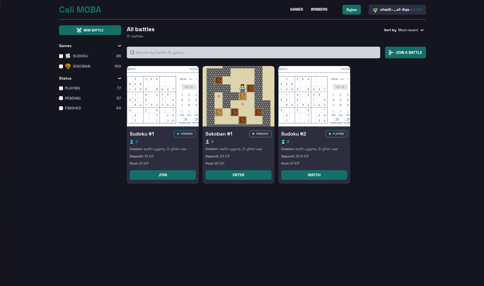
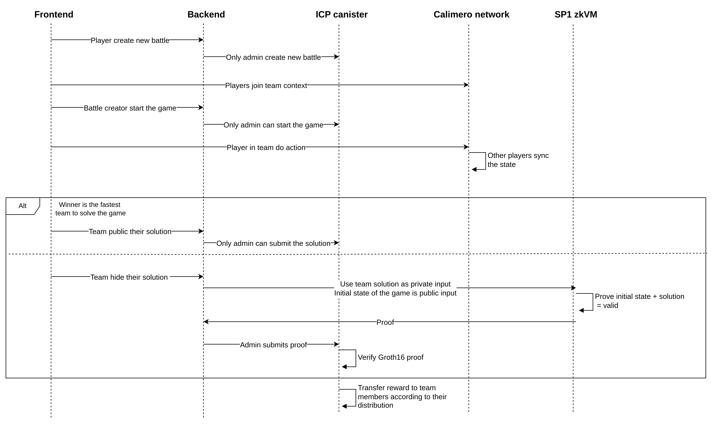

# Cali MOBA - Privacy-centric decentralized MOBA game platform

**Cali MOBA** is a full-stack Web3 MOBA gaming platform designed with a **privacy-first** approach. Developed during the **Calimero x ICP Hackathon**, this project pioneers a **revolutionary** paradigm for decentralized strategy games. You can check out my demo video [here](https://www.youtube.com/watch?v=vOgpqev8gVo).



## Quick Start

> [!WARNING]
>
> Running the SP1 zkVM locally is resource-intensive.  
> Check out the [hardware requirements](https://docs.succinct.xyz/docs/getting-started/hardware-requirements) of SP1.

### Prerequisites:

Ensure you have the following installed:

- [Rust](https://www.rust-lang.org/tools/install)
- [Node.js](https://nodejs.org/en/download/current)
- [dfx](https://internetcomputer.org/docs/current/developer-docs/getting-started/quickstart/first-smart-contract)
- [merod](https://docs.calimero.network/developer-tools/CLI/merod)
- [meroctl](https://docs.calimero.network/developer-tools/CLI/meroctl)

### Installation:

#### 1. Clone the repository:

```bash
git clone https://github.com/dylannn1312/cali-moba
cd cali-moba
```

2. **Deploy ICP canisters**

```bash
cd contracts
```

To test locally, deploy a ledger as shown [here](https://internetcomputer.org/docs/current/references/samples/rust/icp_transfer/).

Deploy the verifier and Sudoku canisters:

```bash
dfx start --background
dfx deploy verifier -y
VERIFIER_CANISTER_ID="canister id that was deployed"
VERIFYING_KEY_HEX=$(tail -c +3 ../games/sudoku/elf/verifying_key_hex)
dfx deploy sudoku --argument "(\\"$VERIFYING_KEY_HEX\\", principal \\"$VERIFIER_CANISTER_ID\\")" -y
```

3. **Setup Admin Calimero node**

```bash
cd cali-application/sudoku/battle
merod --node-name admin init --server-port 1309 --swarm-port 1209
merod --node-name admin run
meroctl --node-name admin app install --path res/sudoku_battle.wasm
```

4. **Set up environment variables**

```bash
# In frontend/.env
API_URL=http://localhost:1204/api/v1
ICP_API_HOST=http://127.0.0.1:4943
TOKEN=icp
TOKEN_DECIMALS=100000000


# In /server/.env
SERVER_HOST=localhost
SERVER_PORT=1204
GAME_OWNER_PEM_FILE=/path/to/owner.pem # pem file whose deployed sudoku canister
GAME_CONTRACT= # Sudoku game canister ID that was deployed
RPC_URL=http://127.0.0.1:4943
SERVICE_FEE=100
APPLICATION_ID= # Calimero application ID that Admin was installed
```

5. **Run backend and frontend**

```bash
cd server && cargo run --release
cd frontend && npm run dev
```

6. Access the game at `http://localhost:3000`

## Overview

### Technology Stack

- **Smart contract**: ICP canister, Groth16 verifier, BN254 pairing
- **Backend server**: Rust, Axum, Tokio, IC-CDK, SP1-SDK
- **zkVM**: SP1
- **UI**: Next.js, Typescript, TailwindCSS, Identity-Kit, Calimero SDK, Dfinity packages

### Key features

1. Create game battles where players deposit funds into a contract, and the winning team claims all funds.
2. Team members communicate and share strategies within a private Calimero context, ensuring absolute privacy.
3. Hide winner's game strategy while verifying game logic in the zkVM and proof verification on-chain.
4. Reusable components, game-agnostic backend services, flexible frontend templates and standard verification patterns.
5. User-friendly interface

### Architecture

For a detailed understanding of the game architecture, watch the demo video.



This architecture guarantees fairness, transparency, and security gameplay.

### Project Structure

```
cali-moba/
├── frontend/          # Next.js frontend application
├── server/            # Rust backend server
├── games/             # Game logic executed in SP1 zkVM
├── contracts/         # Battle logic and Groth16 verifier for SP1
└── cali-application/  # Rules for updating team state
```

### Current Limitations

- **Resources-Intensive**: Generating ZK proofs, especially with zkVM like SP1, requires significant resources.
- **Scalability**: Game state is stored in memory without persistence

### Future Plans

1. Add database for game state persistence
2. Implement real-time battles.
3. Build custom circuits optimized for each game, using libraries like [gnark](https://github.com/Consensys/gnark)
4. Introduce more verifiable strategy games, such as: Word Search, Treasure Hunt, Puzzle Verification Games,...
5. Build a standard interface for game state management